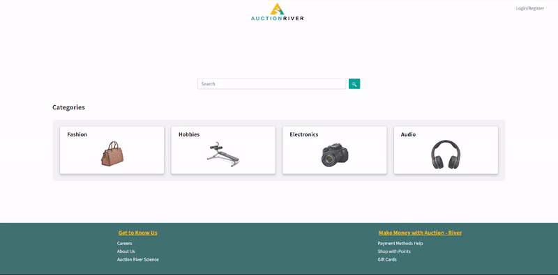
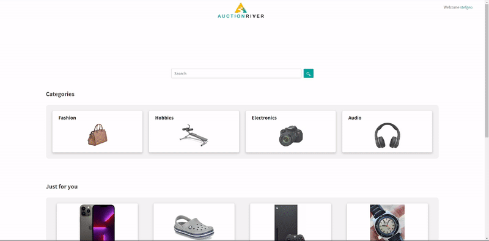
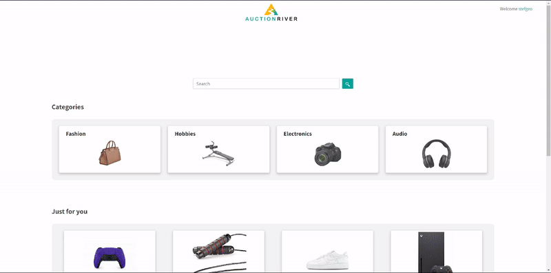
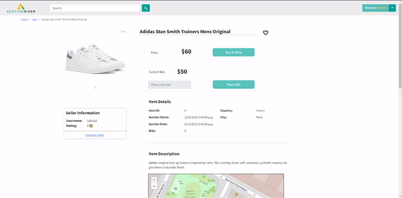

# Action-River
## A web application for auctions and online shopping.

### Technologies Used
- Front-End: <b>React</b> 
- Back-End: <b>Node.js ~ Express-API</b> 
- Database: <b>MongoDB</b> 

---
## UI and Panels

### Application Homepage

A simple main page. Search for items using the search bar or by category using the category list.

### Items Listing

Login to your personal account to buy items or place your bids. Preview all the items available. You don't need to have an account in order to interact/view items.

### Item Detail View

Search for items and preview them. Get details of each item and proceed to buy or auction proccess. For each item we provide the price, last available bid price, auction start datetime, auction end datetime, geolocation, description and seller info.

### User Dashboard

Each registered and accepted user has access to his/her personal account. There, he can be display his/her personal info (provided during registration), see his/her own selling items list and the items he/she has already bought.

### Message Seller

If you are intrested for an item you can send a private message to the seller, asking for availability.

## Items Recommendation System
#### Matrix Factorization algorithm

For the <b>Items Recommendation System</b> we have implemented a matrixFactorization method that returns a matrix with all of the users' preferences. In order to create
this matrix we will use the <b>Matrix Factorization algorithm</b> so that we can suggest items to every user based on their purchase history, the items that they
have seen and the items that they have liked.

Let M be the number of users, N the number of items and K the number of latent
features. We create an M x K matrix (named 'V') and a K x N matrix (named 'F')
and we fill them with random floats in the range [0.1, 0.9]. Then we get the matrix
'X' from the database that contains all users' opinions on every item
(we may not know the opinion of every user on every item). We follow the algorithm
and we calculate in a loop the value of eij for every known element of
matrix 'X'. Then we update the elements of the matrices 'V','F' by doing the
following calculations:

$$ v_{ik'} = v_{ik} + η*2e_{ij}*f_{kj} $$
 
$$ f_{kj'} = f_{kj} + η*2e_{ij}*v_{ik} $$

`η is the learning rate.` 
 

After the loop finishes we perform matrix multiplication on the matrices 'V','F' and
we get the matrix with the predicted opinions of all users for every item.
This matrix is returned and it is later used to decide which items will be
recommended to each user.

